# 💰 Asset-It

<div align="center">


**A smart, minimal, and private wealth tracker built with Flutter**

[](https://flutter.dev)
[](https://dart.dev)
[](LICENSE)
[](https://github.com/yourusername/asset-it-app)

[Features](#-features) • [Installation](#-installation) • [Architecture](#-architecture) • [Security](#-security) • [Contributing](#-contributing)

</div>

---

## 📱 About

**Asset-It** is a comprehensive cross-platform wealth and budget tracker designed with privacy and user experience in mind. Track your assets, manage your finances, monitor your salary and spending, all in one secure application.

### Why Asset-It?

- 🔒 **Privacy-first** - Your data stays on your device
- 🎨 **Beautiful UI** - Modern Material Design 3 interface
- 🌍 **Multi-language** - English and Arabic with RTL support
- 📊 **Visual Analytics** - Charts and insights for your wealth
- 💼 **Budget Management** - Track salary and spending across categories
- 💱 **Multi-currency** - Manage multiple currency profiles
- 📱 **Cross-platform** - Works on Android and iOS
- 🎯 **Offline-first** - Works without internet connection
- 🆓 **Free & Open Source** - No subscriptions, no tracking

---

## 🆕 Recent Updates

### Version 1.0.0 - November 2025

#### 🔐 Enhanced Security & Encryption
- **AES-256-GCM Encryption**: All backups now use military-grade encryption
- **PBKDF2 Key Derivation**: Secure password-based key generation with 5000 iterations
- **HMAC-SHA256 Verification**: Tamper-proof data integrity checks
- **Encrypted Backup Files**: New `.aes` file format for secure data export

#### 🗄️ Database Architecture Improvements
- **Salary Database Migration**: Moved from SharedPreferences to SQLite database
- **Interface-Based Data Sources**: Implemented clean architecture with abstract interfaces
- **Complete Database Backup**: All 7 tables now included in backup/restore
  - Assets, Finances, Currency Choices, Base Currencies, Users, Asset Type Ordering, Salaries
- **Dependency Injection**: Full GetIt integration for better code maintainability

#### 🛠️ Technical Enhancements
- **Isolate-Based Encryption**: Offloaded encryption to prevent UI freezing
- **Secure Random Generation**: Cryptographically secure IV and salt generation
- **Versioned Backup Format**: Future-proof backup file structure
- **Improved Error Handling**: Better validation and error messages

---

## 📸 Screenshots

### Light Theme
<div align="start">
  
  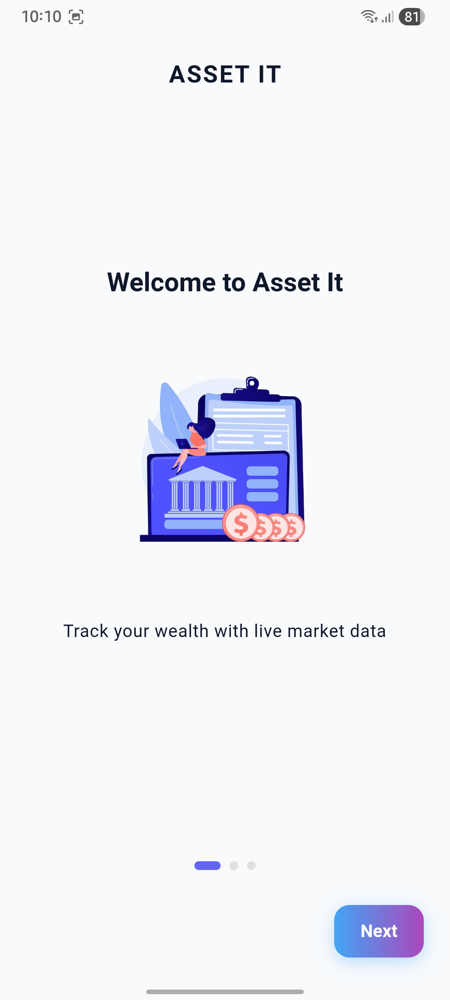
  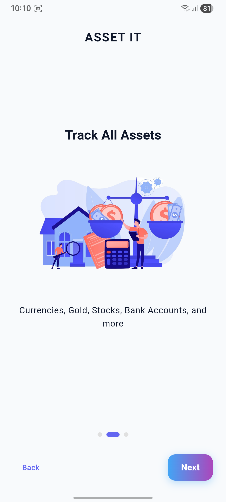
  
  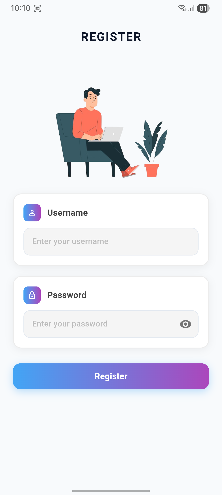
  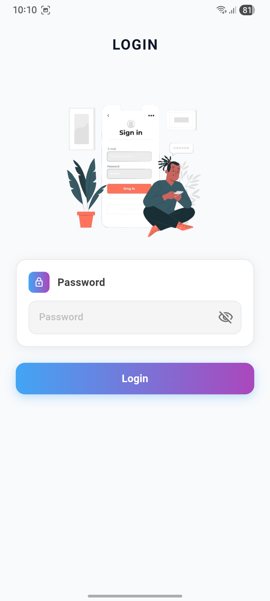
  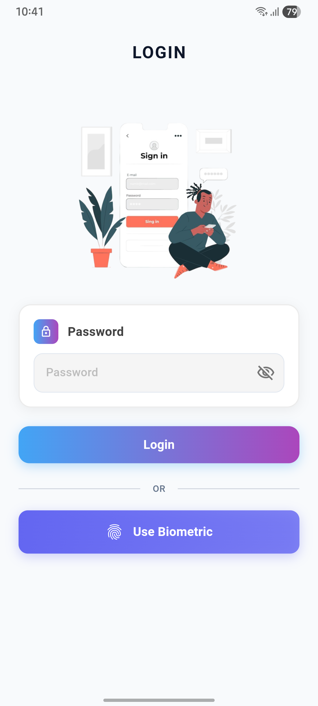
  
  
  
  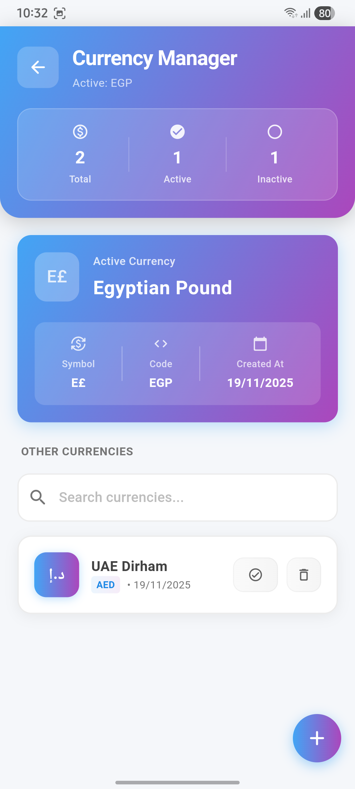
  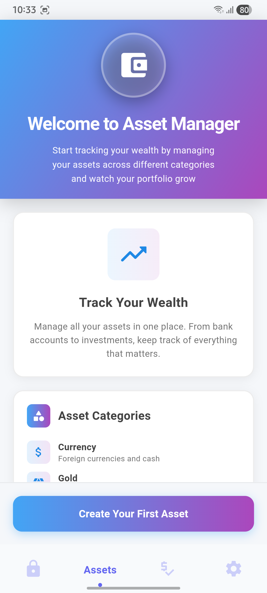
  
  
  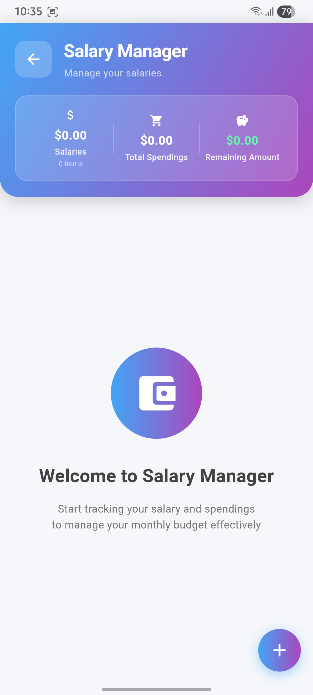
  
  
  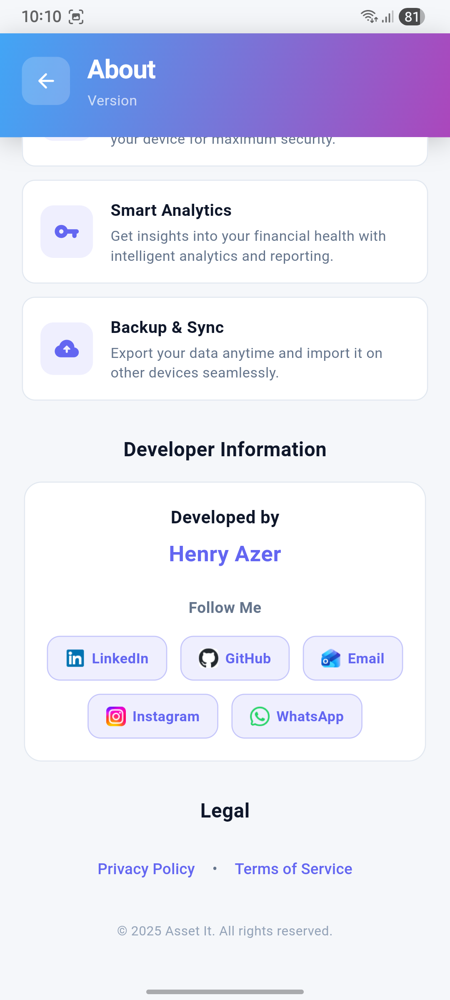
</div>

### Dark Theme
<div align="start">
  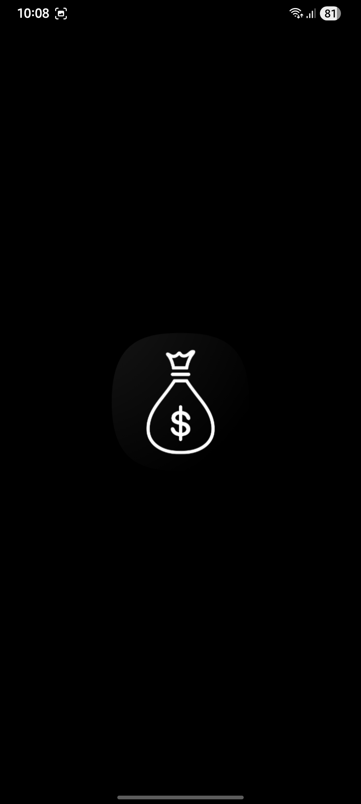
  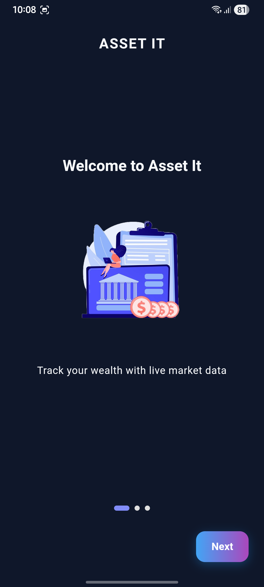
  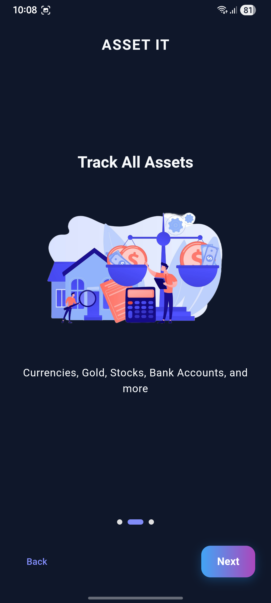
  
  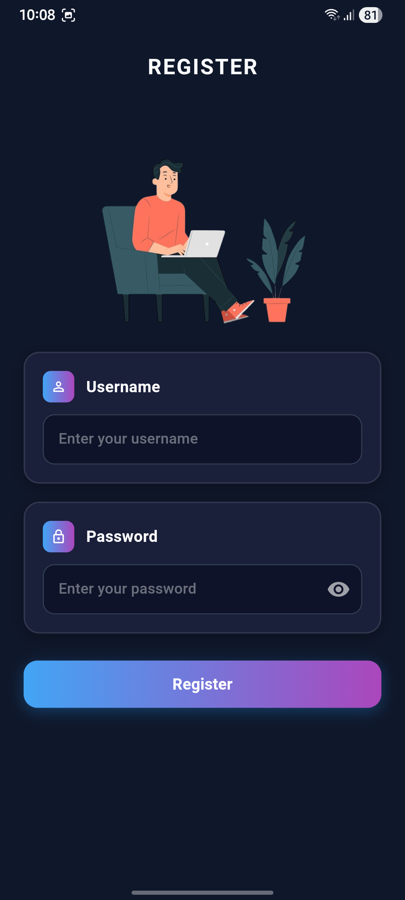
  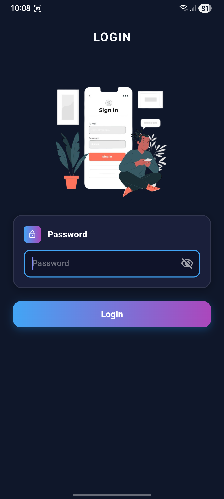
  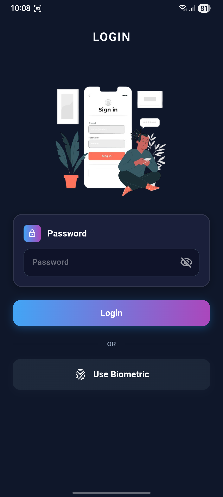
  
  
  
  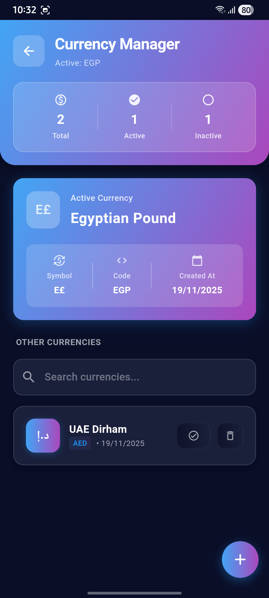
  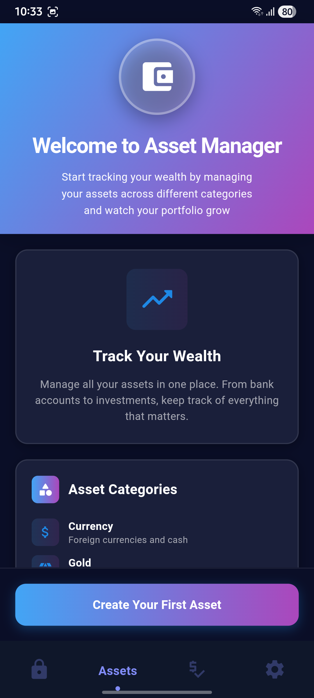
  
  
  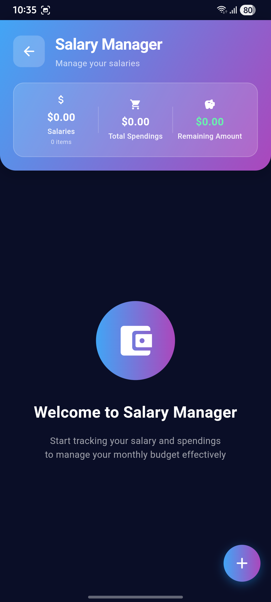
  
  
  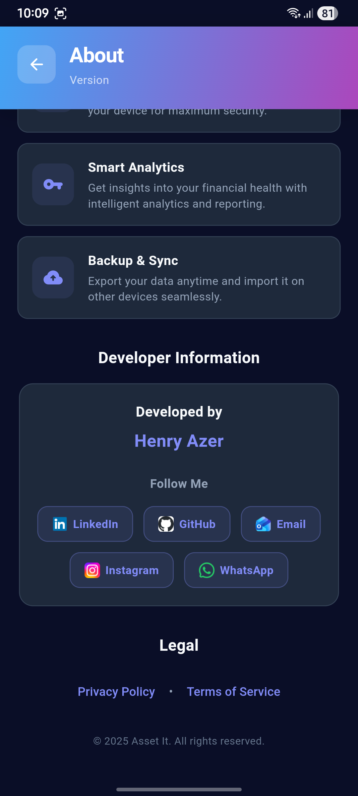
</div>

---

## ✨ Features

### 💰 Asset Management
- **Multi-type asset tracking** - Track 7 different asset types:
  - 💵 Currency holdings
  - 🏆 Gold (bars, coins, jewelry)
  - 📈 Stocks and investments
  - 🏦 Bank accounts
  - 💳 Credit cards
  - 💸 Cash on hand
  - 📋 Loans and debts
- **Comprehensive asset details** - Track quantity, value, notes, and custom fields
- **Search and filter** - Quickly find assets by type or name
- **Asset statistics** - View total assets, liabilities, and net worth
- **Real-time calculations** - Automatic value updates based on market prices

### 💼 Salary & Spending Management
- **Salary tracking** - Monitor your income sources
- **Spending categories** - Track expenses across 8 categories:
  - ⛽ Gas
  - 🍔 Food
  - 🏠 Home
  - 💳 Loan Payments
  - 📦 Installments
  - 💰 Savings
  - 📊 Investments
  - 📝 Other
- **Budget monitoring** - View total spendings and remaining amount
- **Spending notes** - Add details to each expense

### 📊 Finance Manager
- **Multi-currency support** - Create and manage multiple currency profiles
- **Currency switching** - Easily switch between different base currencies
- **Live market data** - Track real-time exchange rates, gold prices, and stock values
- **Custom finance entries** - Add custom currencies, gold types, and stocks
- **Finance history** - View historical price changes over time
- **Manual and API modes** - Choose between automatic API updates or manual entry

### 📈 Dashboard & Analytics
- **Portfolio overview** - Comprehensive view of your net worth
- **Asset distribution charts** - Visual breakdown by asset type
- **Gain/Loss tracking** - Monitor your financial performance
- **Total wealth calculation** - Real-time net worth updates
- **Visual analytics** - Beautiful charts powered by FL Chart

### ☁️ Backup & Restore
- **AES-256-GCM encryption** - Military-grade encryption for all backups
- **Secure file export** - Export encrypted `.aes` backup files
- **File sharing** - Share encrypted backups via other apps
- **Import validation** - Verify backup files before importing
- **Complete data backup** - Includes assets, finances, salaries, currencies, and user data
- **Full database restore** - Complete restoration from encrypted backup files
- **PBKDF2 key derivation** - Secure password-based encryption
- **HMAC verification** - Data integrity checks to prevent tampering
- **Backup preview** - View backup contents before restoring

### 🎨 Customization
- **Theme modes** - Light, Dark, and System-based themes
- **Multi-language support**:
  - 🇬🇧 English
  - 🇸🇦 العربية (Arabic)
- **RTL support** - Full right-to-left language support
- **Custom color schemes** - Beautiful Material Design 3 interface
- **Responsive design** - Optimized for all screen sizes

### 🔒 Security & Privacy
- **Master password** protection
- **Biometric authentication** - Face ID, Touch ID, and Fingerprint support
- **Local-only storage** - All data stays on your device
- **SQLite database** - Secure local database storage
- **AES-256-GCM encryption** - Military-grade backup encryption
- **PBKDF2 key derivation** - Secure password hashing (5000 iterations)
- **HMAC-SHA256 verification** - Tamper-proof data integrity
- **No external tracking** - Complete privacy, no analytics
- **Secure data handling** - All sensitive data encrypted

### ⚙️ Settings & Support
- **User profile management** - Update username and password
- **Language selection** - Easy language switching
- **Theme customization** - Choose your preferred appearance
- **Help & Support** - In-app support system
- **Bug reporting** - Built-in bug report feature
- **Rate app** - Provide feedback directly
- **About section** - App information and developer details

---

## 🏗️ Architecture

Asset-It follows **Clean Architecture** principles with a feature-based organization:

```
lib/
├── core/
│   ├── constants/          # App-wide constants
│   ├── enums/              # Enumerations
│   ├── managers/           # Database & storage managers
│   ├── services/           # Core services (encryption, currency)
│   └── utils/              # Helper utilities
├── config/
│   ├── localization/       # i18n support (English & Arabic)
│   ├── routes/             # Navigation routing
│   └── themes/             # Theme configuration
├── data/
│   ├── datasources/        # Data access layer (interface-based)
│   └── entities/           # Data models (12 entities)
└── features/
    ├── auth/               # Authentication & user management
    ├── assets/             # Asset & salary management
    ├── dashboard/          # Dashboard & analytics
    ├── finance/            # Finance & currency management
    ├── settings/           # App settings & preferences
    ├── onboarding/         # First-time experience
    ├── splash/             # Splash screen
    └── app-navigator/      # Bottom navigation
```

### Tech Stack

| Category | Technology |
|----------|-----------|
| **Framework** | Flutter 3.27.0 |
| **Language** | Dart 3.5.3+ |
| **State Management** | Provider Pattern |
| **Dependency Injection** | GetIt |
| **Local Database** | SQLite (sqflite) |
| **Local Storage** | SharedPreferences |
| **UI Components** | Material Design 3 |
| **Navigation** | Sliding Clipped Nav Bar |
| **Charts** | FL Chart |
| **Internationalization** | Flutter i18n |

### Key Dependencies

```yaml
dependencies:
  # State Management
  provider: ^6.1.2
  get_it: ^7.2.0
  
  # Local Storage
  sqflite: ^2.4.1
  shared_preferences: ^2.3.3
  path_provider: ^2.1.4
  
  # File Operations
  file_picker: ^8.1.2
  share_plus: ^10.0.2
  
  # UI Components
  cached_network_image: ^3.4.1
  flutter_cache_manager: ^3.4.1
  flutter_svg: ^2.0.16
  sliding_clipped_nav_bar: ^3.1.1
  flutter_slidable: ^3.1.1
  fl_chart: ^0.69.0
  
  # Security
  local_auth: ^2.3.0
  crypto: ^3.0.3
  pointycastle: ^3.9.1
  encrypt: ^5.0.3
  
  # Utilities
  intl: ^0.19.0
  package_info_plus: ^8.0.2
  url_launcher: ^6.3.0
  permission_handler: ^11.3.1
  uuid: ^4.3.3
  http: ^1.2.2
  favicon: ^1.1.2
  form_field_validator: ^1.1.0
```

---

## 🚀 Getting Started

### Prerequisites

- Flutter SDK 3.27.0 (or use `.flutter-version` file)
- Dart SDK (>=3.5.3)
- Android Studio / Xcode
- Git

### Installation

1. **Clone the repository**
   ```bash
   git clone https://github.com/henry-azer/asset-it-app.git
   cd asset-it-app
   ```

2. **Install dependencies**
   ```bash
   flutter pub get
   ```

3. **Generate launcher icons**
   ```bash
   flutter pub run flutter_launcher_icons
   ```

4. **Generate native splash screens**
   ```bash
   dart run flutter_native_splash:create
   ```

5. **Run the app**
   ```bash
   flutter run
   ```

### Building for Production

#### Android

```bash
# Build APK
flutter build apk --release

# Build App Bundle (for Play Store)
flutter build appbundle --release
```

#### iOS

```bash
# Build for iOS
flutter build ios --release
```

---

## ⚙️ Configuration

### Customization

#### App Name & Package
- **Android**: `android/app/build.gradle`
- **iOS**: `ios/Runner/Info.plist`

#### Theme Colors
- Edit `lib/config/themes/app_theme.dart`
- Modify color schemes in `lib/core/utils/app_colors.dart`

#### Supported Languages
- Add translations in `assets/lang/`
- Update `lib/config/localization/app_localization.dart`

---

## 📊 Project Statistics

```
┌─────────────────────────────────────┐
│  Lines of Code:      ~15,000+       │
│  Number of Files:    ~100+          │
│  Features:           8              │
│  Languages:          2 (EN, AR)     │
│  Screens:            25+            │
│  Data Entities:      12             │
│  Database Tables:    7              │
│  Asset Types:        7              │
│  Spending Categories: 8             │
└─────────────────────────────────────┘
```

---

## 🔒 Security

### Data Protection

- ✅ **Local-first architecture** - No data sent to external servers
- ✅ **SQLite database** - Secure local database storage
- ✅ **AES-256-GCM encryption** - Military-grade backup encryption
- ✅ **PBKDF2 key derivation** - 5000 iterations for secure key generation
- ✅ **HMAC-SHA256 verification** - Ensures data integrity and prevents tampering
- ✅ **Master password** - Single point of authentication
- ✅ **Biometric authentication** - Fingerprint/Face ID support
- ✅ **No analytics** - No tracking or telemetry

### Encryption Details

- 🔐 **Algorithm**: AES-256-GCM (Galois/Counter Mode)
- 🔑 **Key Derivation**: PBKDF2 with SHA-512 (5000 iterations)
- 🛡️ **Integrity**: HMAC-SHA256 for tamper detection
- 🎲 **Randomization**: Secure random IV (12 bytes) and salt (32 bytes)
- 📦 **Backup Format**: Encrypted `.aes` files with versioning
- 🔒 **Default Password**: Secure fallback for backup encryption

### Best Practices

- 🔐 All data stored in SQLite database
- 🔑 Master password never leaves the device
- 📁 Backups encrypted with AES-256-GCM
- 🚫 No third-party services or APIs for core functionality
- 🔄 Isolate-based encryption to prevent UI freezing

---

## 🎯 Roadmap

### Version 2.0 (Planned)
- [ ] Google Drive sync integration
---

## 🤝 Contributing

Contributions are welcome! Here's how you can help:

### Ways to Contribute

1. **Report bugs** - Open an issue with detailed information
2. **Suggest features** - Share your ideas for improvements
3. **Submit PRs** - Fix bugs or implement new features
4. **Improve docs** - Help make documentation better
5. **Translate** - Add support for more languages

### Development Setup

1. Fork the repository
2. Create feature branch (`git checkout -b feature/amazing-feature`)
3. Commit changes (`git commit -m 'Add amazing-feature'`)
4. Push to branch (`git push origin feature/amazing-feature`)
5. Open a Pull Request

### Code Style

- Follow [Flutter style guide](https://flutter.dev/docs/development/tools/formatting)
- Use meaningful variable and function names
- Add comments for complex logic
- Write unit tests for new features

---

## 📄 License

This project is licensed under the MIT License - see the [LICENSE](LICENSE) file for details.

```
MIT License

Copyright (c) 2025 Asset-It

Permission is hereby granted, free of charge, to any person obtaining a copy
of this software and associated documentation files (the "Software"), to deal
in the Software without restriction, including without limitation the rights
to use, copy, modify, merge, publish, distribute, sublicense, and/or sell
copies of the Software, and to permit persons to whom the Software is
furnished to do so, subject to the following conditions:

The above copyright notice and this permission notice shall be included in all
copies or substantial portions of the Software.
```

---

## 🙏 Acknowledgments

### Built With
- [Flutter](https://flutter.dev) - UI framework
- [Dart](https://dart.dev) - Programming language
- [Material Design](https://material.io) - Design system

### Special Thanks
- Flutter community for amazing packages
- Material Design for beautiful components
- All contributors and testers

---

## 📞 Support

### Get Help

- 🐛 **Bug Reports**: [Open an issue](https://github.com/henry-azer/asset-it-app/issues)
- 📧 **Email**: henryazer@outlook.com

### Community

- ⭐ Star this repo if you find it helpful
- 🔄 Share with others who need a wealth tracker
- 💖 Consider sponsoring the project

---

## 📈 Project Status


**Current Version**: 1.0.0
**Last Updated**: November 2025  

---
<div align="center">

**Made with ❤️ By Henry Azer**

[⬆ Back to Top ⬆](#-asset-it)

</div>
